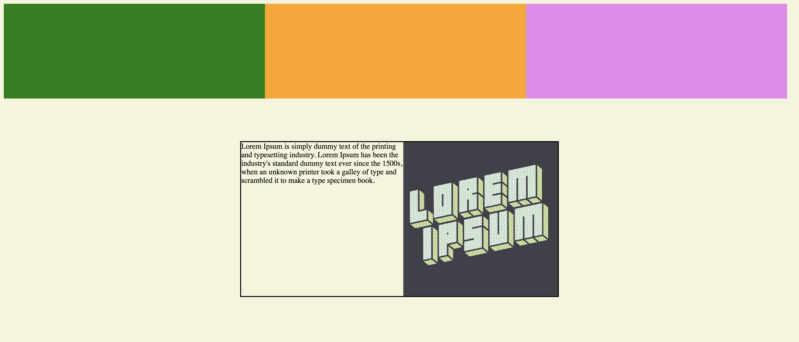

# Floats and Clear Fix Review Activity

## Instructions

**_Activity Three:_**

1. Using the starter code inside of `review_3/unsolved`, float the `divs` named `container-x` so that the `divs` line up on the same row.
2. Be sure to check out the result in a browser as you are working!
3. Next, apply the clear-fix hack on the `div` with the class, `lorem-card` so that the border encapsulates the image.
4. The result should look like this:

