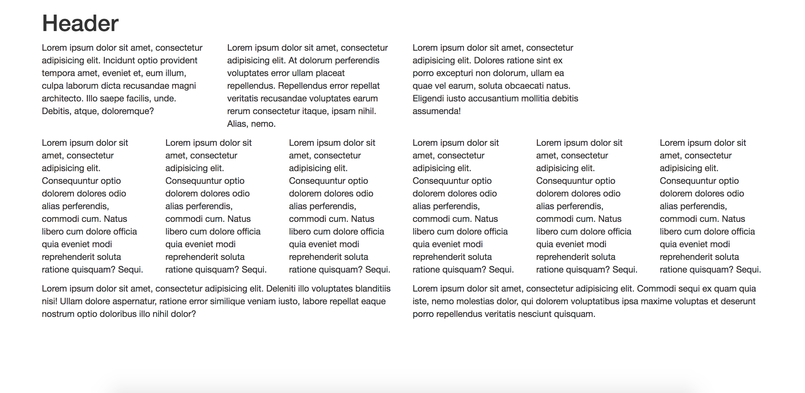

# Text Layout

## Instructions:

Using Bootstrap CSS, create a layout that looks like the one shown below .

**Hint:** Spend some time prior to coding on drawing out the grid layout.

**Hint:** Count the number of rows and columns.

**Hint:** Then use the bootstrap grid syntax to code it out.
